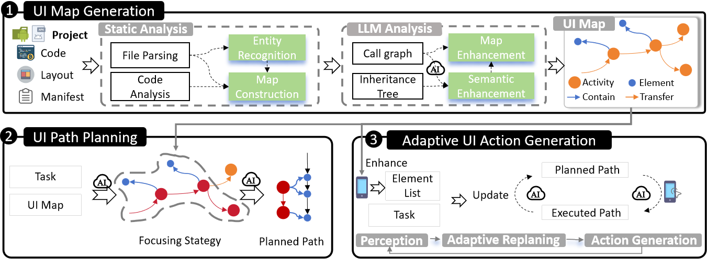

# UI Compass 🧭

 
The paper " `UICOMPASS: UI Map Guided Mobile Task Automation via Adaptive Action Generation`
" has been accepted by EMNLP 2025.

This is the code repository for the paper  “UICOMPASS: UI Map Guided Mobile Task Automation via Adaptive Action Generation”


 <!-- overview -->

> Mobile task automation is an emerging technology that leverages AI to automatically execute routine tasks by users' commands on mobile devices like Android, thus enhancing efficiency and productivity. 
While large language models (LLMs) excel at general mobile tasks through training on massive datasets, they struggle with app-specific workflows. 
To solve this problem, we designed UI Map, a structured representation of target app's UI information.
We further propose a UI Map-guided LLM-based approach UICOMPASS to automate mobile tasks.
Specifically, UICOMPASS first leverages static analysis and LLMs to automatically build UI Map from either source codes of apps or byte codes (\emph{i.e.,} APK packages).
During task execution, UICOMPASS mines the task-relevant information from UI Map to feed into the LLMs, generates a planned path, and adaptively adjusts the path based on the actual app state and action history.
Experimental results demonstrate that UICOMPASS achieves a 15.87\% higher task executing success rate than SOTA approaches.
Even when only APK is available, UICOMPASS maintains superior performance, demonstrating its applicability to closed-source apps.


The repository mainly consists of three parts:  

1. **Generator** → The code section for generating the UI map.
2. **Executor** → The part for task execution.  


## 📥Install 

+ Set up the Android Emulator.
    +   Download Android Studio
    +   Create an Android Virtual Device (AVD).
+  Launch the Android Emulator.
+ [Optional] It's recommended to use conda.

```shell
 conda create -n android_world python=3.11.8
 conda activate android_world
```

+ Clone UI Compass

```shell
git clone [this repo]
cd ./UICompass
```

+ Install Atx-agent
```shell
adb -s emulator-5556 push atx-agent /data/local/tmp/
adb -s emulator-5556 shell chmod 755 /data/local/tmp/atx-agent
# start atx-agent
adb  -s emulator-5554 shell  /data/local/tmp/atx-agent server -d
```
If your Atx-agent is closed, you just need to run the command again.
```shell
adb  -s emulator-5554    shell  /data/local/tmp/atx-agent server -d
```

## 🛠️ UI Map Generator
1. Enter the UI Map Generator
```shell
cd Generator
```

2. Environment Configuration
```shell
conda create -n generator python==3.12
conda activate generator
pip install -r requirements
```

3. Configuration for Apps to Be Parsed
You can open the app_config.json file.
Parse a Single App with the Following Content:
```json
[
{
"app_name" : "Simple-File-Manager",
"target_project" : "/app_project/Simple-File-Manager/app/src/main/",
"source_code" : "kotlin/",
"target_package" : "com.simplemobiletools.filemanager.pro",
"apk_path":"/apk_list/file-manager-fdroid-release.apk"
}
]
```
Or Parse Multiple Apps at Once. For Example:
```json
[
{
"app_name" : "Simple-File-Manager",
"target_project" : "/app_project/Simple-File-Manager/app/src/main/",
"source_code" : "kotlin/",
"target_package" : "com.simplemobiletools.filemanager.pro",
"apk_path":"/apk_list/file-manager-fdroid-release.apk"
},
{
"app_name" : "Simple-Calendar",
"target_project" : "/app_project/Simple-Calendar/app/src/main/",
"source_code" : "kotlin/",
"target_package" : "com.simplemobiletools.calendar.pro",
"apk_path":"/apk_list/calendar-fdroid-release.apk"
}
]
```


2. Run the following command to generate the basic data.  
```shell
 python main.py
```


## 🤖 Executor
### How to intalls and run executor？
1. Enter the Executor folder
```shell
cd Executor
```

2. Environment Configuration
```shell
conda create -n executor python==3.12
conda activate executor
pip install -r requirements
```

3. Task Configuration
In the directory, you can find the file task.json, which can be configured as follows:
```json
{
"app_name": "Simple-Notes",
"apk_name": "it.feio.android.omninotes.alpha",
"task_names": [
"Go to Settings and set data to none."
]
}
```

It also supports running multiple tasks at once. For example:
```json
{
"app_name": "Simple-Notes",
"apk_name": "com.simplemobiletools.notes.pro",
"task_names": [
"Create a text note named 'NewTextNote'",
"Create a checklist note called 'NewCheckList'",
"Delete the note 'Diary'"
]
}
```

4. Install the target APP.
```shell
adb install -r -g ../app_list/notes-fdroid-release.apk 
```


5. Configure the configs.py file.
Modify the following to the corresponding UI Map path:
```python
ui_map_path = "C:/Users/wongj/D/code/acl/AndroidSourceCodeAnalyzer4/code_maps/YouTube.json"
```
Select the main activity to launch:
```python
main_activity = "com.simplemobiletools.applauncher.activities.SplashActivity"
```

Select the code-aware method:
```python
run_method=code_aware_method = 'code-aware'
```
6. Create api.key
You should create an api.key file in the current folder with the following content:
```
sk-.... (your api key)
```
7. Run 
Before running, please ensure that all data required for the task is ready. For example, if the task is `delete the "Diary" note`, please prepare a `"Diary"` note in advance.


```shell 
python run_command.py
```

### Result

Next, the APP should launch normally and you will see the execution results. Then you will find the output under the `output` directory:

<!-- 横向滑动展示 output 目录下的图片 -->
<div style="overflow-x: auto; white-space: nowrap; padding: 10px 0;">
  <!-- 每张图片用 img 标签引入，调整 width 控制图片大小，保持统一尺寸更美观 -->
  
  
  


</div>


### ✨ Dataset
apk_list is the list of application APKs, and app_project is the list of application source code.

You can download the relevant APKs from  [[Fdroid](https://f-droid.org/en/)], or obtain the dataset from [[AndroidWorld](https://github.com/google-research/android_world)] and [[AutoDroid](https://github.com/MobileLLM/AutoDroid.git)].


### Existing result.


## 📝Citation


```latex
@inproceedings{lin2025uicompass,
    title={UICOMPASS: UI Map Guided Mobile Task Automation via Adaptive Action Generation},
    author={Lin, Yuanzhang and Zhang, Zhe and Rui, He and Dong, Qingao and Zhou, Mingyi and Zhang, Jing and Gao, Xiang and Sun, Hailong},
    booktitle={Proceedings of the 2025 Conference on Empirical Methods in Natural Language Processing},
    year={2025}
}
```